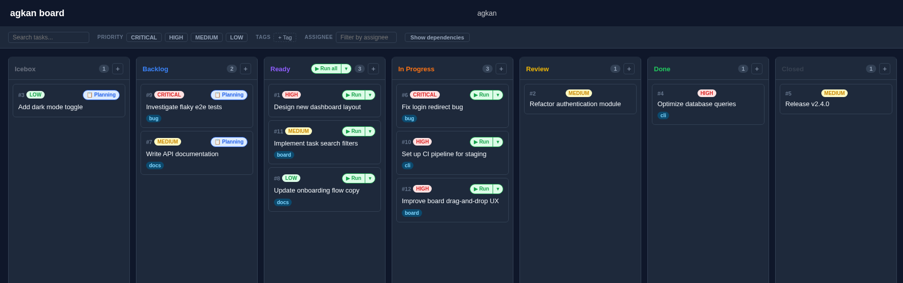

# agkan

[](https://github.com/gendosu/agkan/actions/workflows/test.yml)
[](https://github.com/gendosu/agkan/actions/workflows/quality.yml)

人間とAIコーディングエージェントが一緒にタスクを進めるための、軽量なCLI＆カンバンボードです。



## 特徴

**タスク管理**
- ローカルSQLiteで動く、シンプルで直感的なCLI
- 7つのステータスによるカンバンワークフロー: icebox, backlog, ready, in_progress, review, done, closed
- コマンドライン引数またはMarkdownファイルからタスクを作成。ステータス・作成者・タグで絞り込み
- ステータスごとに見やすい色分け表示

**依存関係**
- ツリー表示に対応した親子関係（`task list --tree`）
- 循環参照を自動検出するブロック関係
- タスクを分類・検索するためのタグ機能

**カンバンボード**
- ローカルで動く、設定不要のWeb UI（`agkan board`）
- ブラウザ上でステータス・タグ・作成者によるフィルタリングと閲覧
- タスク詳細パネルで全履歴とClaude実行ログを確認可能

**AI連携**
- スクリプトや自動化に使える、主要コマンドの機械可読なJSON出力
- Claude Code用の連携パッケージ [agkan-skills](https://github.com/gendosu/agkan-skills)
- ボードから直接Claudeを実行し、ライブストリーミング出力と実行履歴を確認可能
- `agkan init` が登録するSessionStart hookにより、Claude Codeが毎セッション自動でagkanのコンテキストを読み込む

## クイックスタート

以下の5ステップで、カンバンボードが動くところまで進めます。

### 1. インストール

```bash
npm install -g agkan
```

Node.js 20以上とnpmが必要です。GitHubから最新のコードを直接インストールする場合:
```bash
npm install -g https://github.com/gendosu/agkan.git
```

### 2. プロジェクトを初期化

```bash
agkan init
```
```
Created: .agkan.yml
Created: .agkan/ directory
Created: .claude/settings.local.json (added agkan SessionStart hook)
```

### 3. タスクを作成

```bash
agkan task add "Implement login feature" "Implement user authentication system"
```
```
✓ Task created successfully

ID: 1
Title: Implement login feature
Status: backlog
Created: 2026/7/10 15:02:48
```

### 4. タスク一覧を表示

```bash
agkan task list
```
```
Found 1 task(s):

────────────────────────────────────────────────────────────────────────────────

[1] Implement login feature
  Status: backlog
  Priority: medium
  Created: 2026/7/10 15:02:48
```

### 5. カンバンボードを開く

```bash
agkan board
```
```
Server is running on http://localhost:8080
```

別のポートを使いたい場合: `agkan board -p 3000`

## コマンド早見表

各コマンドは `--help` でも使い方を確認できます。

| コマンド | 説明 |
|---|---|
| `agkan init` | `.agkan.yml` と `.agkan/` データディレクトリを初期化 |
| `agkan task add <title> [body]` | タスクを作成（`--status`, `--author`, `--parent`, `--tag`, `--file`, `--json`） |
| `agkan task list` | タスク一覧を表示（`--tree`, `--root-only`, `--status`, `--author`, `--tag`, `--json`） |
| `agkan task find <keyword>` | タイトル・本文でタスクを検索（`--all` で done/closed も含める） |
| `agkan task get <id>` | タスク詳細を表示 |
| `agkan task update <id> <field> <value>` | タスクのstatus・title・body・authorを更新 |
| `agkan task update-parent <id> <parent-id>` | 親タスクを設定・解除（`null`） |
| `agkan task delete <id>` | タスクを削除 |
| `agkan task block add <id> <id2>` | `<id>` が `<id2>` をブロックする関係を追加 |
| `agkan task block remove <id> <id2>` | ブロック関係を削除 |
| `agkan task block list <id>` | ブロックしている/されているタスクを表示 |
| `agkan task meta set <id> <key> <value>` | タスクにメタデータを設定（例: `priority`） |
| `agkan task meta get <id> <key>` | タスクのメタデータを取得 |
| `agkan task meta list <id>` | タスクの全メタデータを一覧表示 |
| `agkan task meta delete <id> <key>` | タスクのメタデータを削除 |
| `agkan task count` | ステータス別のタスク数をカウント（`--status`, `--json`） |
| `agkan tag add <name>` | タグを作成 |
| `agkan tag list` | タスク数付きで全タグを一覧表示 |
| `agkan tag delete <name>` | タグを削除 |
| `agkan tag attach <task-id> <tag>` | タスクにタグを付与 |
| `agkan tag detach <task-id> <tag>` | タスクからタグを解除 |
| `agkan tag show <task-id>` | タスクに付与されたタグを一覧表示 |
| `agkan board` | ローカルのカンバンボードWeb UIを起動 |
| `agkan ps` | 現在実行中のClaudeプロセスを一覧表示 |
| `agkan config get [key]` | 解決済みの設定値を表示 |
| `agkan --help` | 全コマンドを表示 |

全オプション・JSON出力フォーマット・具体的な使用例については **[documentation/cli-reference.ja.md](documentation/cli-reference.ja.md)** を参照してください。

## Claude Code連携

agkanは、人間だけでなくAIコーディングエージェントからも操作できるように設計されています:

- **[agkan-skills](https://github.com/gendosu/agkan-skills)** — タスクの自動実行・プランニング・レビューのためのClaude Codeスキル
- **Run / Plan**: ボードの各タスクカードには `claude` を起動する「Run」ボタンがあり、ドロップダウンからプランモードで実行することもできます
- **ストリームモーダル**: Claude実行中はモーダルにリアルタイムで出力が表示され、「Stop」ボタンと実行中インジケーターが利用できます
- **実行ログ**: タスク詳細パネルの「Run Logs」タブに、過去のClaude実行履歴（タイムスタンプと全出力）が保存されます
- **`agkan ps`**: 別のターミナルから、ボードが現在実行中のClaudeプロセスと、それが紐づくタスクを一覧表示できます

## 設定

プロジェクトルートの `.agkan.yml` で、データベースの保存場所やボードをカスタマイズできます:

```yaml
path: ./.agkan/data.db

board:
  port: 8080
```

データベースパスは環境変数 `AGENT_KANBAN_DB_PATH` でも上書きでき、`.agkan.yml` より優先されます。

テストモード（`NODE_ENV=test`）では、`.agkan-test.yml` と `.agkan-test/` が自動的に使用され、テストが本番のタスクデータベースに影響しないよう分離されます。

プロジェクトごとの管理・モデル選択・パーミッションモードを含む全設定リファレンスは **[documentation/configuration.ja.md](documentation/configuration.ja.md)** を参照してください。

## タスクステータス

タスクは以下の7つのステータスのいずれかで管理されます:

| ステータス | 意味 |
|---|---|
| `icebox` | 積極的に検討していない凍結タスク |
| `backlog` | 未着手のタスク |
| `ready` | 着手可能なタスク |
| `in_progress` | 作業中のタスク |
| `review` | レビュー中のタスク |
| `done` | 完了したタスク |
| `closed` | クローズされたタスク |

## ドキュメント

詳細なリファレンスはこのファイルの外にあります:

| ドキュメント | 説明 |
|---|---|
| [documentation/cli-reference.ja.md](documentation/cli-reference.ja.md) | 全コマンドリファレンス、オプション、JSON出力フォーマット |
| [documentation/configuration.ja.md](documentation/configuration.ja.md) | `.agkan.yml` リファレンス（パス・ボード・モデル・パーミッションモード） |
| [documentation/project-structure.ja.md](documentation/project-structure.ja.md) | リポジトリのディレクトリ構成 |
| [documentation/database-schema.ja.md](documentation/database-schema.ja.md) | SQLiteスキーマリファレンス |
| [documentation/development.ja.md](documentation/development.ja.md) | 技術スタック、ローカルセットアップ、ビルド情報 |
| [documentation/TESTING.ja.md](documentation/TESTING.ja.md) | テストガイド |
| [CONTRIBUTING.ja.md](CONTRIBUTING.ja.md) | コントリビュート方法 |
| [CHANGELOG.ja.md](CHANGELOG.ja.md) | リリース履歴 |

## ライセンス

ISC

## 作成者

GENDOSU
